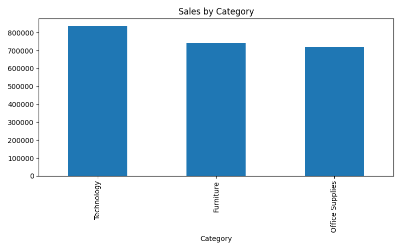
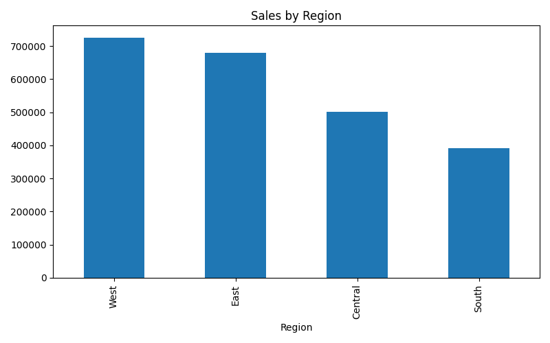
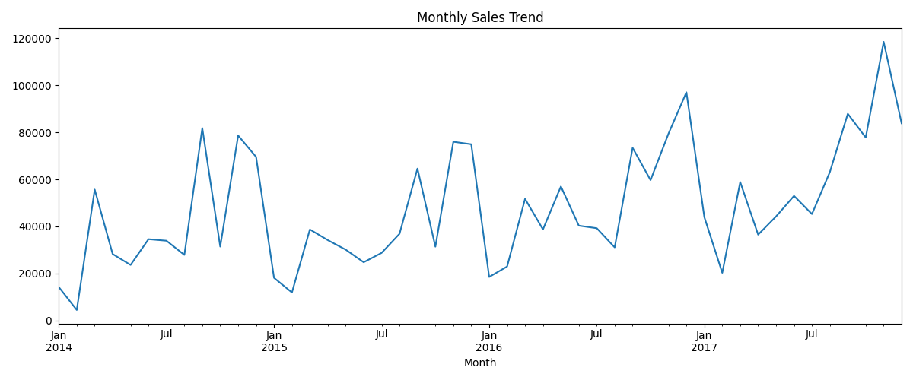
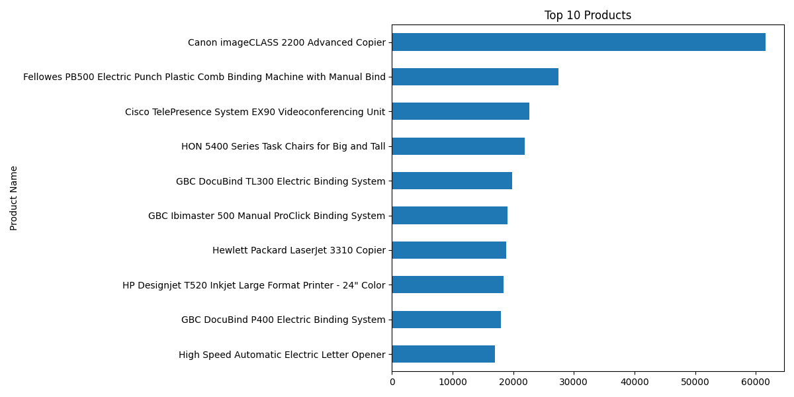
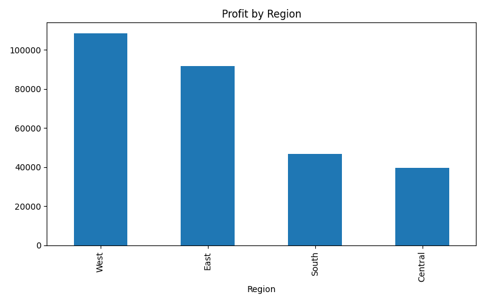

# Business Sales Performance Analytics

## Project Overview
This project analyzes business sales data using the Sample Superstore dataset. The objective is to identify sales trends, top-performing products, regional performance, and business insights.

## Tools Used
- Python
- Pandas
- Matplotlib
- Google Colab

## Dataset
Sample Superstore Dataset

## Key Performance Indicators (KPIs)
- Total Sales
- Total Profit
- Total Orders
- Total Customers

## Visualizations

### Sales by Category

### Sales by Region

### Monthly Sales Trend

### Top 10 Products

### Profit by Region

## Business Insights
- Technology category generated the highest sales.
- West region achieved the highest revenue.
- The top 10 products contributed significantly to overall sales.
- Monthly sales trends help identify seasonal demand.
- Regional profit analysis supports business decision-making.

## Recommendations
- Focus marketing efforts on high-performing regions.
- Maintain inventory for top-selling products.
- Improve strategies in low-performing regions.
- Use sales trends for demand forecasting.

## Author
**V Ganga Purna Chandu Reddy**

Future Interns - Data Science & Analytics Internship
